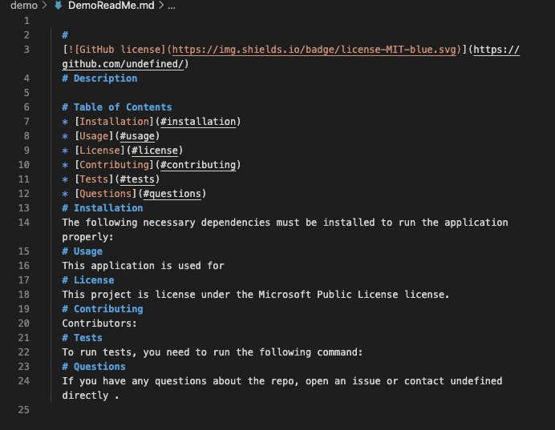

  # Read Me Generator
  
  
  <iframe src="https://drive.google.com/file/d/1IoOYtC_4y4HWezEta8QlGF6k0GWl5oid/preview" width="640" height="480"></iframe>
  # Description
  Helps the user to create/generate a ReadMe file in which it could me more profesional and simpler at the same time. This allows you to follows guidelines such a project description, installation, usage, license information, collabortion and being able to add your GitHub and Email accounts.
  # Table of Contents 
  * [Installation](#installation)
  * [Usage](#usage)
  * [License](#license)
  * [Contributing](#contributing)
  * [Tests](#tests)
  * [Questions](#questions)
  # Installation
  The following necessary dependencies must be installed to run the application properly: 
  # Usage
  ​This application is used for By running the node command, you answer a series of questions to create your ReadMe file.
  # License
  This project is license under the MIT license.
  # Contributing
  ​Contributors: 
  # Tests
  To run tests, you need to run the following command: 
  # Questions
  If you have any questions about the repo, open an issue or contact undefined directly malcantar185@gmail.com.
